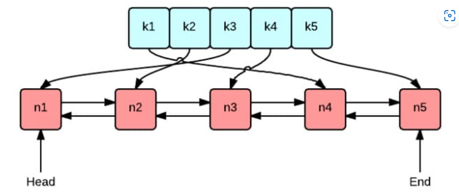

# GeeCache
分布式缓存

v0.0.1 
LRU 缓存淘汰策略 

GeeCache 的缓存全部存储在内存中，内存是有限的，因此不可能无限制地添加数据。
假定我们设置缓存能够使用的内存大小为 N，那么在某一个时间点，添加了某一条缓存记录之后，
占用内存超过了 N，这个时候就需要从缓存中移除一条或多条数据了。那移除谁呢？
我们肯定希望尽可能移除“没用”的数据，那如何判定数据“有用”还是“没用”呢？

我们创建一个包含字典和双向链表的结构体类型 Cache，方便实现后续的增删查改操作

v0.0.2 
实现 GeeCache 核心数据结构 Group，缓存不存在时，调用回调函数获取源数据

接收 key --> 检查是否被缓存 -----> 返回缓存值 ⑴ 
&emsp;|  否 
&emsp; &emsp;|-----> 是否应当从远程节点获取 -----> 与远程节点交互 --> 返回缓存值 ⑵ 
&emsp; &emsp; &emsp; &emsp; |  否 
&emsp; &emsp; &emsp; &emsp; &emsp; &emsp; |-----> 调用`回调函数`，获取值并添加到缓存 --> 返回缓存值 ⑶ 

支持并发读写

我们思考一下，如果缓存不存在，应从数据源（文件，数据库等）获取数据并添加到缓存中。
GeeCache 是否应该支持多种数据源的配置呢？不应该，一是数据源的种类太多，没办法一一实现；
二是扩展性不好。如何从源头获取数据，应该是用户决定的事情，我们就把这件事交给用户好了。
因此，我们设计了一个回调函数(callback)，在缓存不存在时，调用这个函数，得到源数据。